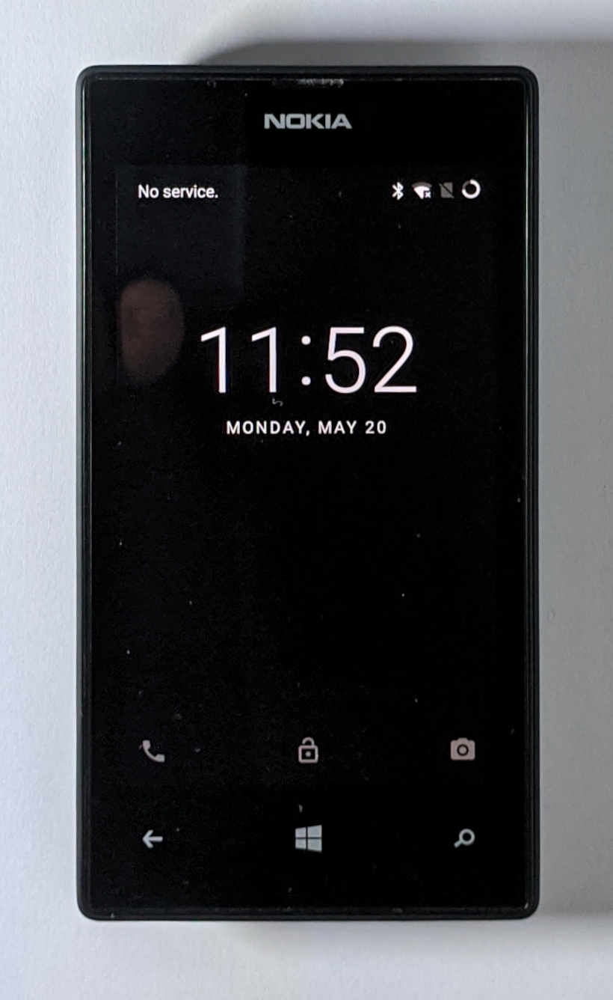
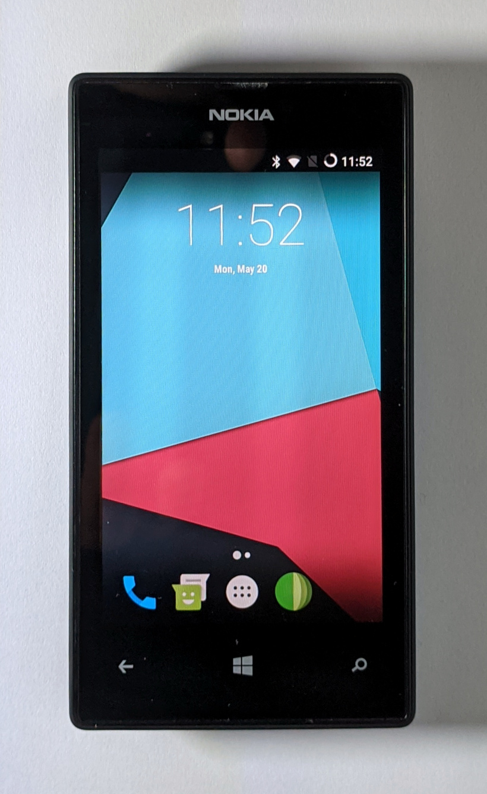

# Install LineageOS 14.1

First, [unlock the bootloader](/content/unlock_bootloader/Readme.md)

## Make a full backup of the phone

> [!CAUTION]
> This backup is mandatory when you want to return to Windows Phone 8.1 - or if the installation of Android failed.

Switch the device to mass storage mode:  
`thor2 -mode rnd -bootmsc`

Copy the content of the device using [Win32DiskImager](https://sourceforge.net/projects/win32diskimager/).  
Select the disk corresponding to "MainOS":  


When the copy is finished: exit mass storage mode.  
`thor2 -mode rnd -reboot`

Send the following command and disconnect the usb cable when the device seems to be locked on the Nokia logo (the device will power-off automatically upon disconnection).  
`thor2 -mode rnd -power_off`

At this point, copy "lineage-14-1-20190701-UNOFFICIAL-fame.zip" in a FAT32 formatted micro SDcard of 2GB. And insert this micro SDcard in the device.

## Install TWRP

Prepare thor2 to put the device "in wait for command" (messaging timeout is disabled):  
`thor2 -mode rnd -asciimsgreq NOKD -asciimsgresp NOKD -skip_com_scan`

Immediatly connect the usb cable (the phone will power-on automatically upon connection).  

Flash the .mbn (multi boot binary) file of [LittleKernel](https://github.com/Android4Lumia/bootloader_msm8227) in the UEFI partition.  
`thor2 -mode uefiflash -partitionname UEFI -partitionimagefile "C:\Users\Public\Downloads\LK Bootloader installer\64 bit installers\lflash_windows_x86_x64\DATA\EMMCBOOT.mbn"`

Reboot the device.  
`thor2 -mode rnd -reboot`

After reboot, the device should be in "fastboot" mode:  


> [!NOTE]
> If fastboot.exe doesn't detect the device, check in device manager > if the device is named "android" with vid_18d1&pid_d00d > you have to install an "android driver" for this VID/PID like - for example - "Google Kedacom KDB Interface Driver 11.0.0.0".

Boot a [special image of TWRP](https://github.com/Android4Lumia/notes/tree/master/tools) which will update the partition table of the device:  
`fastboot boot DATA\gptflasher.img`

Flash the _TZ_, _modem_ and _recovery_ partitions of the device:  
```
fastboot flash TZ DATA\TZ.img
fastboot flash modem DATA\modem.img
fastboot flash recovery DATA\twrp.img
```

> [!NOTE]
> We have to modify the TZ (Trust Zone) partition in order to allow the loading of some drivers in LineageOS.  

Reboot in "recovery mode" to start [TWRP](https://github.com/omnirom/android_bootable_recovery/tree/android-7.1) 3.0.2-0  
`fastboot oem reboot-recovery`

Twrp > Wipe > Format Data (then choose "Reboot System" and hold volume-up to boot in recovery mode)  
Twrp > Mount > Select cache (if not selectable: Twrp > Wipe > Advanced Wipe > Select cache > Swipe to Wipe)  
Twrp > Mount > Select Data  
Twrp > Mount > Select System   
Twrp > Mount > Select Micro SDCard (check in "Select Storage" that Micro SDCard is selected)  
Twrp > Install > Select lineage-14-1-20190701-UNOFFICIAL-fame.zip > Swipe to confirm Flash
Wait for the end of the installation then "Reboot System".

> [!NOTE]
> First boot of LineageOS is quite long (~7 minutes)





 
