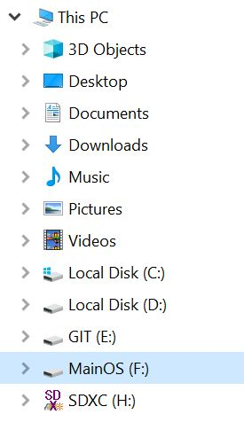
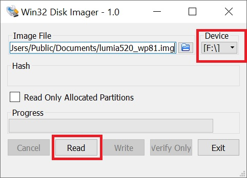

# Install LineageOS 14.1

First [unlock the bootloader](/content/unlock_bootloader/Readme.md)

## Make a full backup of the phone

> [!CAUTION]
> This backup is mandatory when you zwant to return to Windows Phone 8.1 - of if the installation of Android failed.

Switch the phone to mass storage mode:  
`thor2 -mode rnd -bootmsc`

Copy the content of the phone using Win32DiskImager.
Select the disk corresponding to "MainOS":  

When the copy is finished: exit mass storage mode.
`thor2 -mode rnd -reboot`

Send the following command and disconnect the usb cable when the device seems to be locked on the Nokia logo (the device will power-off automatically upon disconnection).  
`thor2 -mode rnd -power_off`

## Install TWRP

Prepare thor2 to put the device "in wait for command" (messaging timeout is disabled):  
`thor2 -mode rnd -asciimsgreq NOKD -asciimsgresp NOKD -skip_com_scan`

Immediatly connect the usb cable (the phone will power-on automatically upon connection).  

