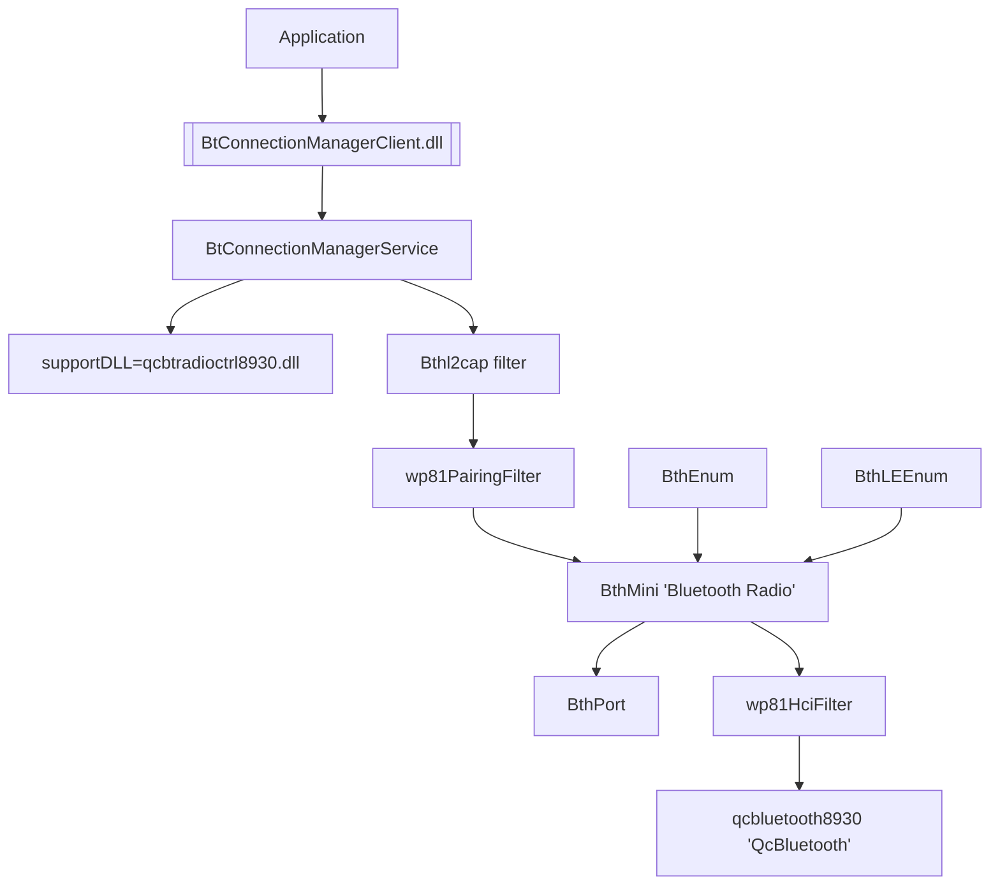

# Bluetooth stack

```mermaid
graph TD;
    A@{ shape: rect, label: "Application"}-->B@{ shape: subproc, label: "BtConnectionManagerClient.dll"};
    B-->C[BtConnectionManagerService];
    C-->D[supportDLL=qcbtradioctrl8930.dll];
    C-->E[Bthl2cap filter];
    E-->F[wp81PairingFilter];
    F-->G[BthMini 'Bluetooth Radio'];
    G-->J[BthPort];
    K[BthEnum]-->G;
    L[BthLEEnum]-->G;
    G-->H[wp81HciFilter];
    H-->I[qcbluetooth8930 'QcBluetooth'];
```
