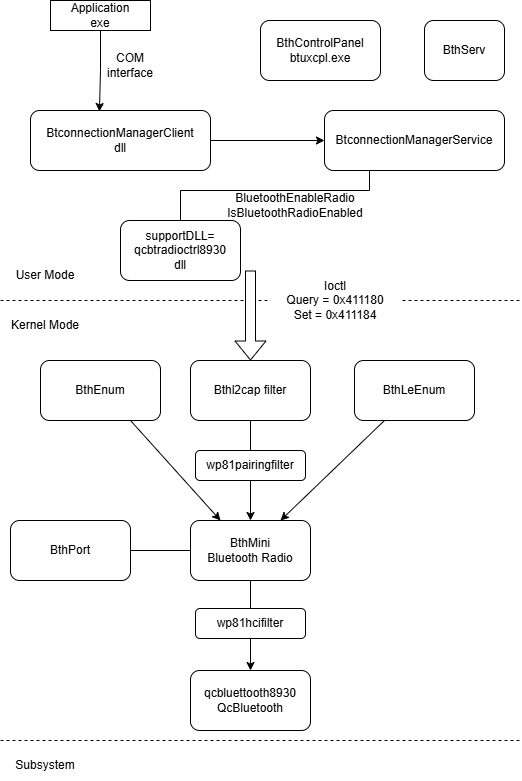

# Bluetooth stack



## QcBluetooth8930.sys

This is the bus driver.  
It is started by the Qcwcn8930 driver.  
The _EvtDevicePrepareHardware_ of the driver reads the file C:\DPP\QCOM\BT.PROVISION  
This binary file contains the address of the bluetooth device.  
Example of content (the bluetooth address is 78-92-3E-C7-7B-53):
| BYTE 0 | BYTE 1 | BYTE 2 | BYTE 3 | BYTE 4 | BYTE 5 | BYTE 6 | BYTE 7 |
|--------|--------|--------|--------|--------|--------|--------|--------|
| 01 | 06 | 78 | 92 | 3E | C7 | 7B | 53 |

Then it sends the [HCI Vendor Specific command SET BR_ADDR](#hci-vs-set-bd-addr) to set the bluetooth address of the device.  

Registries of the bus driver:  
`HKEY_LOCAL_MACHINE\SYSTEM\ControlSet001\services\qcbluetooth`  
`HKEY_LOCAL_MACHINE\SYSTEM\ControlSet001\Enum\ACPI\QCOM01E0\3&ddcf83e&0&1`  
`HKEY_LOCAL_MACHINE\SYSTEM\ControlSet001\Control\Class\{4d36e97d-e325-11ce-bfc1-08002be10318}\0093`  

| Registry value | value | comment |
|----------------|-------|---------|
| BtOnOff | 0x0=off or 0x1=on | Persists the state of the driver. |

GUID Bus type:  
`4D36E978-E325-11CE-BFC1-08002BE10318` (Serial Device)

GUID of the interface:  
`2388B968-8AC1-401F-9C4C-11713C110F39`  
`B53A9DB7-1343-4C7F-B7BC-251B03DD8E34`

GUID of the ETW provider:  
`C484A08D-41CE-4CD6-AF73-06F987827ACE`

It communicates with the following devices:  
| Device | Driver | Comment |
|--------|--------|---------|
| \Device\SMD | qcsmd8930.sys | Shared Memory Device |

The bus driver creates a child device _Physical Device Object (PDO)_ with the following properties:  
- CompatibleID : `MS_BTHX_BTHMINI`
- DeviceType : FILE_DEVICE_BUS_EXTENDER
- DeviceLocation : `Serial HCI Bus - Bluetooth Function`
- DeviceDescription : `SerialHciBus_01`
- HardwareID : `SystemBusQc\SMD_BT`
- ClassGUID : E0CBF06C-CD8B-4647-BB8A-263B43F0F974 (Bluetooth)

This child device forwards all the IOCTL_BTHX IoCtl requests to its parent device.

Registry of the child device:  
`HKLM\System\CurrentControlSet\Enum\SystemBusQc\SMD_BT\4&315a27b&0&4097`


### internal IOCTL 0x22003

This IOCTL is sent by QcBluetooth8930.sys  

| Name | Device name | InputBuffer size | OutputBuffer Size |
|------|-------------|------------------|--------------------|
| Link to a SMD channel ? | \Device\SMD | 28 | 0 |

Content of the input buffer:  
| Bytes 00-03 | Bytes 04-07 | Bytes 08-0B | Bytes 0C-0F | Bytes 10-13 | Bytes 14-17 | Bytes 18-1B |
|-------------|-------------|-------------|-------------|-------------|-------------|-------------|
| pointer to a string containing the name of the SMD channel | 06 00 00 00 | 11 00 00 00 | 00 20 00 00 | 00 00 00 00 | 00 00 00 00 | 00 00 00 00 |

SMD channels:  
- `APPS_RIVA_BT_CMD`  send HCI Command packets, receive HCI Event packets.  
- `APPS_RIVA_BT_ACL`  send/receive HCI ACL packets.  

### internal IOCTL 0x22007

This IOCTL is sent by QcBluetooth8930.sys  

| Name | Device name | InputBuffer size | OutputBuffer Size |
|------|-------------|------------------|--------------------|
| Release a SMD channel ? | \Device\SMD | 0 | 0 |

### IOCTL 0x2A8008

This IOCTL is processed by QcBluetooth8930.sys  

| Name | InputBuffer size | OutputBuffer Size |
|------|------------------|--------------------|
| Query the "BtOnOff" state of the Bluetooth device | 0 | 1 |

Content of the output buffer:  
| Byte 00 |
|---------|
| 0=off 1=on | 

	
### IOCTL 0x2A8004

This IOCTL is processed by QcBluetooth8930.sys  

| Name | InputBuffer size | OutputBuffer Size |
|------|------------------|--------------------|
| Switch BT on/off | 1 | 0 |

Content of the input buffer:  
| Byte 00 |
|---------|
| 0=off 1=on | 


### IOCTL 0x410403

This IOCTL is processed by QcBluetooth8930.sys  

| Name | InputBuffer size | OutputBuffer Size |
|------|------------------|--------------------|
| IOCTL_BTHX_GET_VERSION | 0 | 4 |
	
### IOCTL 0x410407

This IOCTL is processed by QcBluetooth8930.sys  

| Name | InputBuffer size | OutputBuffer Size |
|------|------------------|--------------------|
| IOCTL_BTHX_SET_VERSION | 4 | 0 |

Notes: do nothing  

### IOCTL 0x41040B	

This IOCTL is processed by QcBluetooth8930.sys  

| Name | InputBuffer size | OutputBuffer Size |
|------|------------------|--------------------|
| IOCTL_BTHX_QUERY_CAPABILITIES | 0 | 16 |
	
### IOCTL 0x41040F	

This IOCTL is processed by QcBluetooth8930.sys  

| Name | InputBuffer size | OutputBuffer Size |
|------|------------------|--------------------|
| IOCTL_BTHX_WRITE_HCI | >= 6 | 4 |

Send a HCI Command/ACL packet to the subsystem.  
		
### IOCTL 0x410413	

This IOCTL is processed by QcBluetooth8930.sys 

| Name | InputBuffer size | OutputBuffer Size |
|------|------------------|--------------------|
| IOCTL_BTHX_READ_HCI | 4 | >= 6 |

Read a HCI Event/ACL packet from the subsystem.  


## HCI Vendor Specific

See  
[hci_qcomm_init/bthci_qcomm.h](https://github.com/ele7enxxh/msm8909w-law-2-0_amss_standard_oem/blob/1710/LINUX/android/vendor/qcom/proprietary/bt/hci_qcomm_init/bthci_qcomm.h)  
[hci_qcomm_init/bthci_qcomm_common.c](https://github.com/ele7enxxh/msm8909w-law-2-0_amss_standard_oem/blob/1710/LINUX/android/vendor/qcom/proprietary/bt/hci_qcomm_init/bthci_qcomm_common.c)  
[hci_qcomm_init/bthci_qcomm_linux.cpp](https://github.com/ele7enxxh/msm8909w-law-2-0_amss_standard_oem/blob/1710/LINUX/android/vendor/qcom/proprietary/bt/hci_qcomm_init/bthci_qcomm_linux.cpp)  
[hci_qcomm_init/btqsocnvmutils.c](https://github.com/ele7enxxh/msm8909w-law-2-0_amss_standard_oem/blob/1710/LINUX/android/vendor/qcom/proprietary/bt/hci_qcomm_init/btqsocnvmutils.c)  

```
BT_QSOC_EDL_CMD_OPCODE             (0xFC00)
BT_QSOC_NVM_ACCESS_OPCODE          (0xFC0B)
BT_QSOC_RIVA_STR_ID                "Release 5.01.0"
BT_QSOC_EDL_CMD_CODE               (0x00)
BT_QSOC_NVM_ACCESS_CODE            (0x0B)
BT_QSOC_VS_EDL_APPVER_RESP   	   (0x02)
```

__Application Get Version__

```
c< 04 00 00 00 01 00 FC 01 06
```
| HCI message length | type _command_ (not counted in the _HCI message length_) | Vendor Specific OpCode (BT_QSOC_EDL_CMD_OPCODE) | Command parameter length | Application Get Version |
|--------------------|----------------------------------------------------------|-------------------------------------------------|--------------------------|-------------------------|
| 04 00 00 00 | 01 | 00 FC | 01 | 06 |


```
e= 5D 00 00 00 04 FF 5B 00 02 58 20 20 20 20 52 65 6C 65 61 73 65 20 35 2E 30 31 2E 30 20 28 42 75 69 6C 64 20 32 30 30 33 29 20 5B 50 46 3D 4D 42 41 41 41 41 4E 41 5A 57 31 31 35 30 30 38 38 20 42 42 3D 32 30 30 33 20 4C 4D 50 3D 32 30 30 33 20 43 46 47 3D 52 41 4D 20 50 48 59 3D 30 32 30 30 5D
```
| HCI message length  | type _event_ (not counted in the _HCI message length_) | Vendor Specific Event | Event parameter length | EDL Vendor specific Cmd (BT_QSOC_EDL_CMD_CODE) | Vendor specific Application version Response (BT_QSOC_VS_EDL_APPVER_RESP) | "Release 5.01.0 (Build 2003) [PF=MBAAAANAZW1150088 BB=2003 LMP=2003 CFG=RAM PHY=0200]" |
|---------------------|--------------------------------------------------------|-----------------------|------------------------|------------------------------------------------|---------------------------------------------------------------------------------|----------------------------------------------------------------------------------------|
| 5D 00 00 00 | 04 | FF | 5B | 00 | 02 | 58 20 20 20 20 52 65 6C 65 61 73 65 20 35 2E 30 31 2E 30 20 28 42 75 69 6C 64 20 32 30 30 33 29 20 5B 50 46 3D 4D 42 41 41 41 41 4E 41 5A 57 31 31 35 30 30 38 38 20 42 42 3D 32 30 30 33 20 4C 4D 50 3D 32 30 30 33 20 43 46 47 3D 52 41 4D 20 50 48 59 3D 30 32 30 30 5D |

```
e= 06 00 00 00 04 0E 04 01 00 00 00
```
| HCI message length  | type _event_ (not counted in the _HCI message length_) | Command Complete Event | Event parameter length | Num_HCI_Command_Packets, ready to receive HCI command (0x01) | Command_Opcode NOP (No OPeration) | Return_Parameters |
|---------------------|--------------------------------------------------------|------------------------|------------------------|--------------------------------------------------------------|-----------------------------------|-------------------|
| 06 00 00 00 | 04 | 0E | 04 | 01 | 00 00 | 00 |


<a name="hci-vs-set-bd-addr">__SET BR_ADDR__</a>  

```
c< 0C 00 00 00 01 0B FC 09 01 02 06 53 7B C7 3E 92 78
```
| HCI message length | type _command_ (not counted in the _HCI message length_) | Vendor Specific OpCode (BT_QSOC_NVM_ACCESS_OPCODE) | Command parameter length | NVM item number (BD_ADDR) | NVM item size | NVM item value |
|--------------------|----------------------------------------------------------|----------------------------------------------------|--------------------------|---------------------------|---------------|----------------|
| 0C 00 00 00 | 01 | 0B FC | 09 | 01 02 | 06 | 53 7B C7 3E 92 78 |

```
e= 0C 00 00 00 04 FF 0A 0B 01 02 06 53 7B C7 3E 92 78
```
| HCI message length  | type _event_ (not counted in the _HCI message length_) | Vendor Specific Event | EDL Vendor specific Cmd (?) | Vendor specific NVM Access Response (BT_QSOC_NVM_ACCESS_CODE) | NVM item number (BD_ADDR) | NVM item size | NVM item value |
|---------------------|--------------------------------------------------------|-----------------------|-----------------------------|---------------------------------------------------------------|---------------------------|---------------|----------------|
| 0C 00 00 00 | 04 | FF | 0A | 0B | 01 02 | 06 | 53 7B C7 3E 92 78 |


```
e= 06 00 00 00 04 0E 04 01 00 00 00
```
| HCI message length  | type _event_ (not counted in the _HCI message length_) | Command Complete Event | Num_HCI_Command_Packets, ready to receive HCI command (0x01) | Command_Opcode NOP (No OPeration) | Return_Parameters |
|---------------------|--------------------------------------------------------|------------------------|--------------------------------------------------------------|-----------------------------------|-------------------|
| 06 00 00 00 | 04 | 0E | 04 | 01 | 00 00 | 00 |


__Wake Device ?__ (not send to the subsystem)

```
c< 04 00 00 00 01 FF FF FF FF
```
| HCI message length | type _command_ (not counted in the _HCI message length_) | Magic number |
|--------------------|----------------------------------------------------------|--------------|
| 04 00 00 00 | 01 | FF FF FF FF |


## Qcwcn8930.sys

Manage the loading of the WCN image and the reset of the subsystem.  
After the reset of the WCN subsystem, it creates the PDO for the Wifi, the Bluetooth and the FM radio.  

Registries of the driver:  
`HKEY_LOCAL_MACHINE\SYSTEM\ControlSet001\services\qcwcn`  
`HKEY_LOCAL_MACHINE\SYSTEM\ControlSet001\Enum\ACPI\QCOM0E20\2&daba3ff&0`  
`HKEY_LOCAL_MACHINE\SYSTEM\ControlSet001\Control\Class\{4d36e97d-e325-11ce-bfc1-08002be10318}\0079`

| Registry value | value | comment |
|----------------|-------|---------|
| WcnImagePath | `\SystemRoot\system32\qcwcnss8930.mbn` | Filename of the WCN image. Default is `C:\Windows\System32\WCNSS.MBN` |
| RestartEnabled | 0x00=SSR(SubSystem Restart) disabled, 0x01=SSR(SubSystem Restart) enabled, 0x02=WCN_RESTART_SURPRISE_REMOVE_ONLY | ? |
| MaxRestartCount | ? | ? |
| RestartTimer | ? | ? |

GUID of the ETW provider:  
`{98D8E493-33D4-4802-AD80-4DD111760D19}`

It communicates with the following devices:  
| Device | Driver | Comment |
|--------|--------|---------|
| \Device\RPEN | qcrpen8930.sys | RPE Notifier |
| \Device\SMSM | qcsmsm8930.sys | Shared Memory State Machine |
| \Device\PIL | qcpil8930.sys | Peripheral Image Loader |

Example of WPP logs at the start of the phone:
```
[1]0004.0084::06/06/2025-12:19:03.186 [qcwcn8930_guid01]!EvtDriverDeviceAdd[58]!Enter
[1]0004.0084::06/06/2025-12:19:03.187 [qcwcn8930_guid01]!EvtDriverDeviceAdd[60]!WdfDeviceCreate succeeded, hDevice=7417FC10
[1]0004.0084::06/06/2025-12:19:03.188 [qcwcn8930_guid01]!DriverEntry[28]!Enter
[1]0004.0084::06/06/2025-12:19:03.189 [qcwcn8930_guid01]!read_Registry[29]!Will load the subsystem image from the path obtained from registry: \SystemRoot\system32\qcwcnss8930.mbn
[1]0004.0084::06/06/2025-12:19:03.190 [qcwcn8930_guid01]!read_Registry[35]!RestartEnabled=1, WCN SSR will be enabled
[1]0004.0084::06/06/2025-12:19:03.191 [qcwcn8930_guid01]!read_Registry[36]!MaxRestartCount, WdfRegistryQueryULong returned 0xc0000034(STATUS_OBJECT_NAME_NOT_FOUND)
[1]0004.0084::06/06/2025-12:19:03.191 [qcwcn8930_guid01]!read_Registry[37]!Default value will be used for MaxRestartCount
[1]0004.0084::06/06/2025-12:19:03.193 [qcwcn8930_guid01]!read_Registry[38]!MaxRestartCount=30
[1]0004.0084::06/06/2025-12:19:03.200 [qcwcn8930_guid01]!read_Registry[39]!RestartTimer, WdfRegistryQueryULong returned 0xc0000034(STATUS_OBJECT_NAME_NOT_FOUND)
[1]0004.0084::06/06/2025-12:19:03.201 [qcwcn8930_guid01]!read_Registry[40]!Default value will be used for RestartTimer
[1]0004.0084::06/06/2025-12:19:03.201 [qcwcn8930_guid01]!read_Registry[41]!RestartTimer=60
[1]0004.0084::06/06/2025-12:19:03.203 [qcwcn8930_guid04]!RpeInit[36]!RpeInit OK
[1]0004.0084::06/06/2025-12:19:03.203 [qcwcn8930_guid04]!RpeInit[37]!Guid is 93367d0f-35ce-4ec4-8e38-bb33030c58b2
[1]0004.0084::06/06/2025-12:19:03.204 [qcwcn8930_guid04]!RpeInit[38]!Driver name is WCN
[1]0004.0084::06/06/2025-12:19:03.205 [qcwcn8930_guid04]!RpeInit[39]!Version is 0
[1]0004.0084::06/06/2025-12:19:03.206 [qcwcn8930_guid04]!RpeInit[40]!Size is 16
[0]0004.0084::06/06/2025-12:19:03.208 [qcwcn8930_guid04]!RpeInit[41]!RpeClientInitMultiSegment returned STATUS_SUCCESS. RpeClientInitMultiSegment OK or RPE driver not avail. Continue
[0]0004.0084::06/06/2025-12:19:03.217 [qcwcn8930_guid04]!RegisterRPEStateNotification[51]!Waiting for readiness of WCN subsystem
[0]0004.0084::06/06/2025-12:19:03.222 [qcwcn8930_guid04]!RpeInit[43]!RegisterRPEStateNotification with GUID_05 returned STATUS_SUCCESS. RegisterRPEStateNotification OK or RPE driver not avail. Continue
[0]0004.0084::06/06/2025-12:19:03.224 [qcwcn8930_guid04]!RegisterRPEStateNotification[51]!Waiting for readiness of WCN subsystem
[0]0004.0084::06/06/2025-12:19:03.230 [qcwcn8930_guid04]!RpeInit[45]!RegisterRPEStateNotification with GUID_06 returned STATUS_SUCCESS. RegisterRPEStateNotification OK or RPE driver not avail. Continue
[1]0004.01B4::06/06/2025-12:19:04.079 [qcwcn8930_guid01]!OpenIOTargetByName[103]!Target Device PDEVICE_OBJECT=8BDFB030
[1]0004.01B4::06/06/2025-12:19:04.081 [qcwcn8930_guid01]!OpenIOTargetByName[104]!PDO PDEVICE_OBJECT=88958A90
[1]0004.01B4::06/06/2025-12:19:04.082 [qcwcn8930_guid01]!OpenIOTargetByName[105]!File Object PFILE_OBJECT=8BFCBBD8
[1]0004.01B4::06/06/2025-12:19:04.083 [qcwcn8930_guid01]!OpenIOTargetByName[106]!File Handle HANDLE=800004D4
[1]0004.01B4::06/06/2025-12:19:04.084 [qcwcn8930_guid01]!SendInternalIoctlSynchronously[107]!Enter
[1]0004.01B4::06/06/2025-12:19:04.084 [qcwcn8930_guid01]!SendInternalIoctlSynchronously[107]!Enter
[1]0004.01B4::06/06/2025-12:19:04.085 [qcwcn8930_guid01]!OpenIOTarget_PIL[12]!Enter
[1]0004.01B4::06/06/2025-12:19:04.086 [qcwcn8930_guid01]!OpenIOTarget_PIL[16]!Target Device PDEVICE_OBJECT=8BC9BD98
[1]0004.01B4::06/06/2025-12:19:04.087 [qcwcn8930_guid01]!OpenIOTarget_PIL[17]!PDO PDEVICE_OBJECT=8895B850
[1]0004.01B4::06/06/2025-12:19:04.088 [qcwcn8930_guid01]!OpenIOTarget_PIL[18]!File Object PFILE_OBJECT=8BFCFA28
[1]0004.01B4::06/06/2025-12:19:04.089 [qcwcn8930_guid01]!OpenIOTarget_PIL[19]!File Handle HANDLE=800004B8
[1]0004.01B4::06/06/2025-12:19:04.089 [qcwcn8930_guid01]!OpenIOTarget_PIL[20]!Succeeded in opening IOTarget on PIL driver, saved IOTarget to device context
[1]0004.01B4::06/06/2025-12:19:04.091 [qcwcn8930_guid01]!sub_40E3C4[133]!2nd parameter value=1
[1]0004.01B4::06/06/2025-12:19:04.092 [qcwcn8930_guid01]!sub_40E3C4[135]!switch value=19
[1]0004.01B4::06/06/2025-12:19:04.092 [qcwcn8930_guid01]!call_PoFxPowerControl[109]!Enter
[0]0004.01B4::06/06/2025-12:19:04.114 [qcwcn8930_guid01]!call_PoFxPowerControl[110]!PoFxPowerControl returns STATUS_SUCCESS
[0]0004.01B4::06/06/2025-12:19:04.115 [qcwcn8930_guid01]!call_PoFxPowerControl[111]!PoFxPowerControl output status PEP_STATE_SYNC_PATH
[0]0004.01B4::06/06/2025-12:19:04.119 [qcwcn8930_guid01]!call_PoFxPowerControl[112]!exit 2nd parameter value=0x00000000(FALSE)
[0]0004.01B4::06/06/2025-12:19:04.120 [qcwcn8930_guid01]!sub_40E3C4[135]!switch value=7
[0]0004.01B4::06/06/2025-12:19:04.120 [qcwcn8930_guid04]!send_IoCtl_0x3200C_Request_01[52]!Enter
[0]0004.01B4::06/06/2025-12:19:04.121 [qcwcn8930_guid04]!send_IoCtl_0x3200C_Request_02[52]!Enter
[0]0004.01B4::06/06/2025-12:19:04.122 [qcwcn8930_guid01]!sub_40E3C4[150]!Performing Load image and reset hardware for WCNSS...
[0]0004.01B4::06/06/2025-12:19:04.123 [qcwcn8930_guid01]!send_IOCTL_PIL_TZ_LOAD_or_RELOAD_IMAGE[44]!Enter
[0]0004.01B4::06/06/2025-12:19:04.124 [qcwcn8930_guid01]!send_IOCTL_PIL_TZ_LOAD_or_RELOAD_IMAGE[46]!Requesting PIL driver to load WCN image
[0]0004.01B4::06/06/2025-12:19:04.126 [qcwcn8930_guid01]!send_IOCTL_PIL_TZ_LOAD_or_RELOAD_IMAGE[47]!Request to load WCN image created, sending to PIL driver
[1]0004.01B4::06/06/2025-12:19:04.190 [qcwcn8930_guid01]!send_IOCTL_PIL_TZ_LOAD_or_RELOAD_IMAGE[52]!WCN image loaded, Physical address returned from PIL driver: 8F001228
[1]0004.01B4::06/06/2025-12:19:04.192 [qcwcn8930_guid01]!send_IOCTL_PIL_TZ_LOAD_or_RELOAD_IMAGE[53]!Loaded WCN subsystem hardware with image: \SystemRoot\system32\qcwcnss8930.mbn
[1]0004.01B4::06/06/2025-12:19:04.193 [qcwcn8930_guid01]!sub_40E3C4[152]!Loading image for WCN subsystem through PIL succeeded
[1]0004.01B4::06/06/2025-12:19:04.494 [qcwcn8930_guid01]!sub_40E3C4[153]!IRIS XO clock is configured
[1]0004.01B4::06/06/2025-12:19:04.495 [qcwcn8930_guid01]!AuthAndRelease[54]!Enter
[1]0004.01B4::06/06/2025-12:19:04.496 [qcwcn8930_guid01]!AuthAndRelease[55]!Requesting PIL driver to reset WCN hardware after the image is loaded
[1]0004.01B4::06/06/2025-12:19:04.936 [qcwcn8930_guid01]!AuthAndRelease[118]!AuthAndRelease value=10
[1]0004.01B4::06/06/2025-12:19:04.938 [qcwcn8930_guid01]!sub_40E3C4[155]!Authorize and Reset for WCN subsystem through PIL succeeded
[1]0004.01B4::06/06/2025-12:19:04.939 [qcwcn8930_guid01]!sub_40E3C4[135]!switch value=21
[0]0004.015C::06/06/2025-12:19:05.018 [qcwcn8930_guid04]!EvtSSUp[53]!Enter
[0]0004.015C::06/06/2025-12:19:05.020 [qcwcn8930_guid04]!EvtSSUp[54]!WCN subsystem is up and running
[1]0004.0178::06/06/2025-12:19:05.021 [qcwcn8930_guid01]!sub_40E3C4[133]!2nd parameter value=4
[1]0004.0178::06/06/2025-12:19:05.022 [qcwcn8930_guid01]!sub_40E3C4[135]!switch value=18
[0]0004.0178::06/06/2025-12:19:22.278 [qcwcn8930_guid01]!sub_40E3C4[133]!2nd parameter value=6
[0]0004.0178::06/06/2025-12:19:22.280 [qcwcn8930_guid01]!sub_40E3C4[135]!switch value=0
[0]0004.0178::06/06/2025-12:19:22.281 [qcwcn8930_guid01]!sub_40E3C4[135]!switch value=20
[0]0004.0178::06/06/2025-12:19:22.282 [qcwcn8930_guid01]!call_PoFxPowerControl[109]!Enter
[1]0004.0198::06/06/2025-12:19:22.283 [qcwcn8930_guid01]!call_PoFxPowerControl[123]!Enter
[1]0004.0198::06/06/2025-12:19:22.284 [qcwcn8930_guid01]!call_PoFxPowerControl[123]!Enter
[1]0004.0198::06/06/2025-12:19:22.285 [qcwcn8930_guid01]!call_PoFxPowerControl[123]!Enter
[0]0004.0178::06/06/2025-12:19:22.291 [qcwcn8930_guid01]!call_PoFxPowerControl[110]!PoFxPowerControl returns STATUS_SUCCESS
[0]0004.0178::06/06/2025-12:19:22.292 [qcwcn8930_guid01]!call_PoFxPowerControl[111]!PoFxPowerControl output status PEP_STATE_SYNC_PATH
[0]0004.0178::06/06/2025-12:19:22.295 [qcwcn8930_guid01]!call_PoFxPowerControl[112]!exit 2nd parameter value=0x00000001(TRUE)
[0]0004.0178::06/06/2025-12:19:22.296 [qcwcn8930_guid01]!change_InterfaceClassGUID_state[23]!Enter
[1]0004.0178::06/06/2025-12:19:22.298 [qcwcn8930_guid01]!change_InterfaceClassGUID_state[26]!WCN device interface is published
[1]0004.0178::06/06/2025-12:19:22.298 [qcwcn8930_guid01]!setField30[22]!Enter
[1]0004.0178::06/06/2025-12:19:22.299 [qcwcn8930_guid01]!sub_40E3C4[147]!published interface successfully
[1]0004.0178::06/06/2025-12:19:22.301 [qcwcn8930_guid01]!sub_40E3C4[149]!RPE_STATE_ID_READY_FOR_COMMANDS
[1]0004.0178::06/06/2025-12:19:22.302 [qcwcn8930_guid01]!sub_40E3C4[135]!switch value=8
```


### internal IOCTL 0x32008

This IOCTL is sent by Qcwcn8930.sys  

| Name | Device name | InputBuffer size | OutputBuffer Size |
|------|-------------|------------------|--------------------|
| IOCTL_INTERNAL_SMSM_RESET | \Device\SMSM | 4 | 4 |

Content of the input buffer:  
| Bytes 00-03 | 
|-------------|
| 01 00 00 00 | 

The output buffer contains a pointer to the function `FuncSmsmReset` 

### internal IOCTL 0x32010

This IOCTL is sent by Qcwcn8930.sys  

| Name | Device name | InputBuffer size | OutputBuffer Size |
|------|-------------|------------------|--------------------|
| IOCTL_INTERNAL_SMSM_STATE_GET | \Device\SMSM | 0 | 4 |

The output buffer contains a pointer to the function `smsm_state_get` 

### internal IOCTL 0x3200C

This IOCTL is sent by Qcwcn8930.sys  

| Name | Device name | InputBuffer size | OutputBuffer Size |
|------|-------------|------------------|--------------------|
| Callback | \Device\SMSM | 12 | 0 |

The completion routine of the device control request is executed in case of success or error during the reset of the subsystem.` 

Content of the input buffer when we set the error callback:  
| Bytes 00-0C | 
|-------------|
| 03 00 00 00 40 00 00 00 40 00 00 00 |

Content of the input buffer when we set the success callback:  
| Bytes 00-0C | 
|-------------|
| 00 00 00 00 00 00 00 00 00 00 00 00 |


### internal IOCTL 0x9C41241C

This IOCTL is sent by Qcwcn8930.sys  

| Name | Device name | InputBuffer size | OutputBuffer Size |
|------|-------------|------------------|--------------------|
| IOCTL_PIL_TZ_LOAD_IMAGE | \Device\PIL | 540 | 4 |

Content of the input buffer:  
| Bytes 00-0F | Bytes 10-13 | Bytes 14-21B |
|-------------|-------------|--------------|
| 0f 7d 36 93 ce 35 c4 4e 8e 38 bb 33 03 0c 58 b2 | 06 00 00 00 | Null terminated WCHAR string `\SystemRoot\system32\qcwcnss8930.mbn` |

The first 16 bytes of the input buffer is the GUID of the RPE client:  
`93367d0f-35ce-4ec4-8e38-bb33030c58b2`

The output buffer contains the physical address where the image was loaded.


### internal IOCTL 0x9C412420

This IOCTL is sent by Qcwcn8930.sys  

| Name | Device name | InputBuffer size | OutputBuffer Size |
|------|-------------|------------------|--------------------|
| IOCTL_PIL_TZ_RELOAD_IMAGE | \Device\PIL | 20 | 4 |

Content of the input buffer:  
| Bytes 00-0F | Bytes 10-13 |
|-------------|-------------|
| 0f 7d 36 93 ce 35 c4 4e 8e 38 bb 33 03 0c 58 b2 | 06 00 00 00 |

The first 16 bytes of the input buffer is the GUID of the RPE client:  
`93367d0f-35ce-4ec4-8e38-bb33030c58b2`

The output buffer contains the physical address where the image was loaded.


### internal IOCTL 0x9C412410

This IOCTL is sent by Qcwcn8930.sys  

| Name | Device name | InputBuffer size | OutputBuffer Size |
|------|-------------|------------------|--------------------|
| IOCTL_PIL_TZ_AUTH_IMAGE_AND_RESET | \Device\PIL | 0 | 0 |
