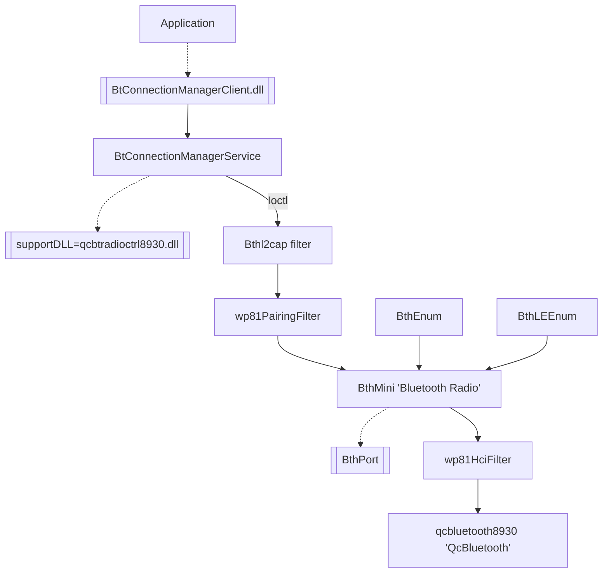

# Bluetooth stack

```mermaid
graph TD;
    A@{ shape: rect, label: "Application"}-.->B@{ shape: subproc, label: "BtConnectionManagerClient.dll"};
    B-->C@{ shape: rect, label: "BtConnectionManagerService"};
    C-.->D@{ shape: subproc, label: "supportDLL=qcbtradioctrl8930.dll"};
    C-- Ioctl -->E@{ shape: rect, label: "Bthl2cap filter"};
    E-->F@{ shape: rect, label: "wp81PairingFilter"};
    F-->G@{ shape: rect, label: "BthMini 'Bluetooth Radio'"};
    G-.->J@{ shape: subproc, label: "BthPort"};
    K@{ shape: rect, label: "BthEnum"}-->G;
    L@{ shape: rect, label: "BthLEEnum"}-->G;
    G-->H@{ shape: rect, label: "wp81HciFilter"};
    H-->I@{ shape: rect, label: "qcbluetooth8930 'QcBluetooth'"};
```
