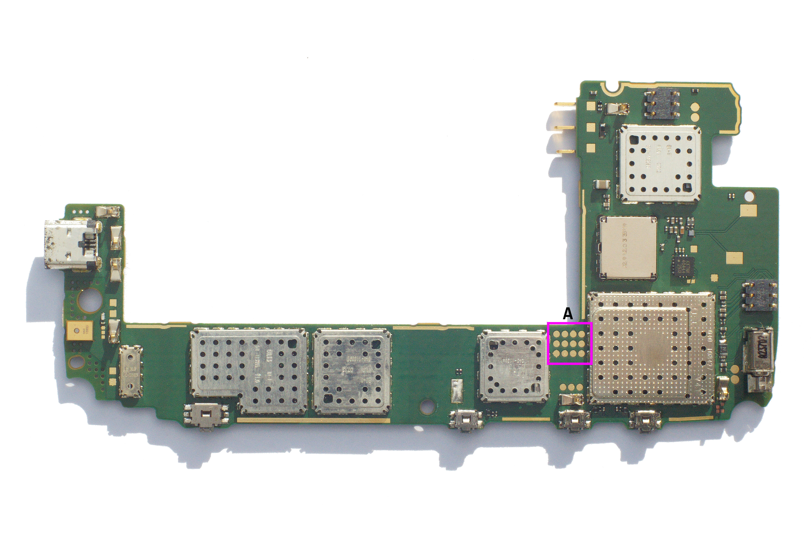
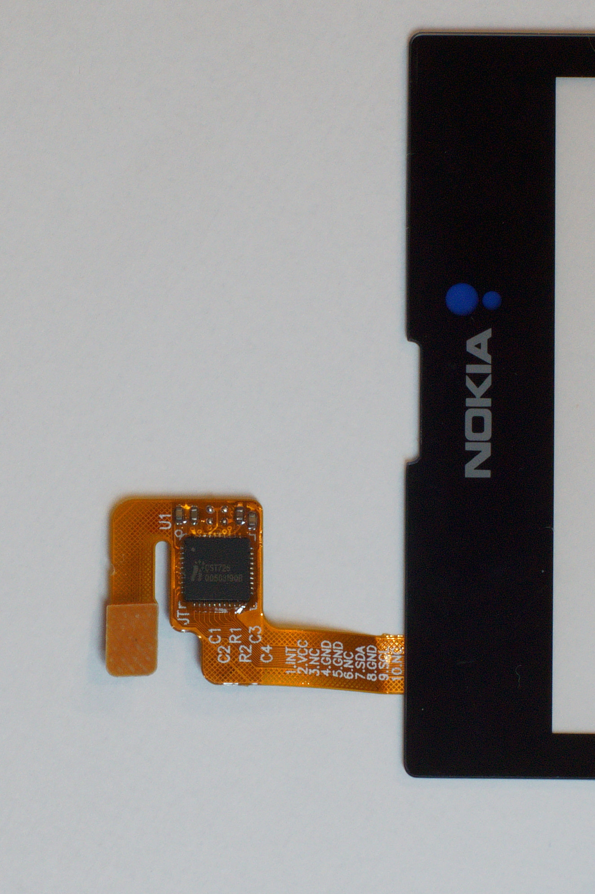
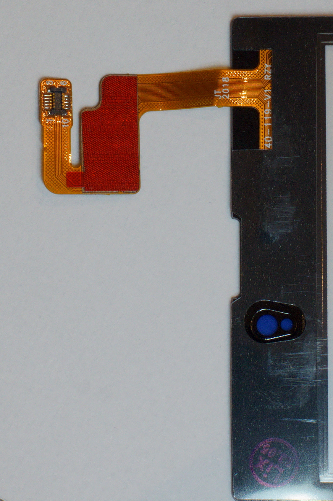
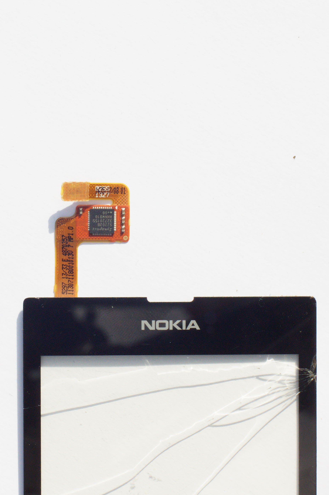

# Electronic components

| Device Name | Code Name | Model | Comment |
|-------------|-----------|-------|---------|
| Lumia 520 | fame_cmmc | RM-913 | China |
| Lumia 520 | fame_row | RM-914 | International |
| Lumia 520 | fame_lta | RM-915 | US |
| Lumia 521 | fame_tmo | RM-917 | US (T-Mobile) |
| Lumia 525 | glee_row | RM-998 | RAM 1Go - International |
| Lumia 526 | glee_cmmc | RM-997 | RAM 1Go - China Mobile |

Soc (System on a Chip) MSM8227 (Mobile Station Modem, 8=premium smartphones(>7 mass market smartphones >6  feature phones), 2=UMTS(6=UMTS+CDMA, 9=4G), 27=30 but without HDMI support)  
  
MSM8227 = MSM8930 without 4G and HDMI and limited to 1GHz vs 1.2GHz  
A-Family chip. 
  
32bits 28nm Qualcomm Snapdragon S4 Plus   
2x 1GHz Krait 200 (armv7, Cortex A15 compatible, neon 128bits, FPU VFPv4-D32)  
L2 cache 1MB  
L1 data cache 16KB / core  
Hexagon QDSP6v4 500MHz  
GPU Qualcomm Adreno 305  
PM8038 		Power Management  
WTR1605		UMTS/GSM/GPS  
WCD9304		Audio   
WCN3660		Wifi/Bluetooth/FM  (WCNSS = Wireless Connectivity Subsystem, code name = "RIVA")  
512Mo 32-bit LPDDR2  (2x512Mo in case of Lumia 525 and Lumia 526)  
eMMC 8GB  
SD (Secure Digital) Card max 64GB microSD, microSDXC  
BL-5J 1430 mAh battery  
4-inch IPS LCD, 480x800 resolution  
Rear camera 5 MP (2592 x 1944 pixels) autofocus, f/2.4, 28mm (wide), 1/4.0", autofocus  
720p@30fps  
Bluetooth 4.0, A2DP, LE/ aptX (Windows Phone 8.1 Denim update)  
Micro-USB 2.0  
Wi-Fi :802.11b/g/n, WiFi Hotspot  
Multi-touch capacitive touchscreen, ambient light sensor, proximity sensor  
FM radio  
2G:Quad band GSM/EDGE (850/900/1800/1900 MHz)  
3G:850/1900/2100 MHz  
GPS A-GPS, CellID, GLONASS, SA-GPS  

| OS | code name |
|----|-----------|
| Windows Phone 8.0 | Apollo |
| Windows Phone 8.0 GDR 1 | Portico ?	|
| Windows Phone 8.0 GDR 2 | ?	|
| Windows Phone 8.0 GDR 2 | Lumia Amber	|
| Windows Phone 8.0 GDR 3 | ?	|
| Windows Phone 8.0 GDR 3 | Lumia Black	|
| Windows Phone 8.1 | Blue |
| Windows Phone 8.1 | Lumia Cyan |
| Windows Phone 8.1 Update 1 | Lumia Denim |

## Board

### Tests points

A:
|             |              |           |        |
|-------------|--------------|-----------|--------|
| DBG_UART_RX	|	DBG_UART_TX	 |	PS_HOLD	 | SRST_N |
| TRST_N			| TCK				   |  TDO			 | RTCK   |
| GROUND			| VREG_L11_IO 1.8V	 |	TDI			 | TMS    |

## CST726 (Non genuine - Capacitive Touch Controller)  
  
  

## Synaptics S2202B Touchscreen Controller (genuine)
  
  

# Similar phones:  
Nokia Lumia 720 (MSM8227)  
Nokia Lumia 620 (MSM8227)  
Sony Xperia M (MSM8227)  
HTC Windows Phone 8S A620t (MSM8227)  
HTC Windows Phone 8S A620e (MSM8627)  
HTC Windows Phone 8S A620d (MSM8927)  
Huawei Ascend G6 LTE (MSM8927)  
Huawei Ascend W1 (MSM8230)  
Huawei Ascend W2 (MSM8230)  
BlackBerry Z3 (MSM8230)  
Gigabyte GSmart Simba SX1 (MSM8230)  
LG Optimus L9 II (MSM8230)  
Nokia Lumia 1320 (MSM8230)  
Sony Xperia L (MSM8230)  
