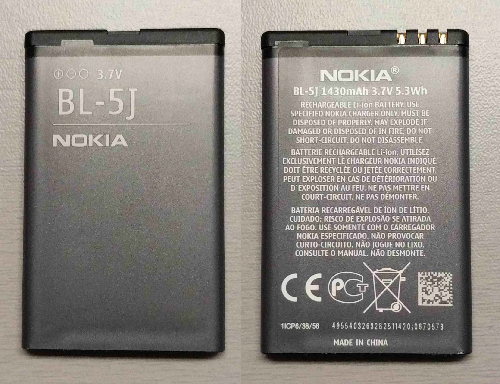

# Electrical power

Main source of power is the BL-5J battery.  

Looking at the front side of the battery, the 3 pins of the connector are from left to right:  
- VBAT
- GND
- BSI (Battery Size Indicator)

This battery comes in at least three different variants:    

| Name | Resistance between BSI and GND |
|------|--------------------------------|
| Nokia 1320mAh | 100K&Omega; |
| Nokia 1430mAh | 110K&Omega; |
| Third party 1430mAh | 101K&Omega; |

The battery can be recharged through the USB port.

When in power off state, the phone can be started by applying the following current to the USB port (Vcc and Gnd pins)

| Voltage | Duration | Current |
|---------|----------|---------|
| min/max 4.3v / 6.0v | min 250ms | 1.5mA |

> [!Note]
> It looks like the RTC of the phone doesn't have an alarm wake function (see [acpitime driver](https://github.com/fredericGette/Lumia520/blob/main/content/drivers/acpitime.md))  
> __But we can use the USB port to periodically start the phone.__  
> See this example of [an electronic pulse generator](https://github.com/fredericGette/Lumia520/blob/main/content/power/pulse_generator/README.md) to start the phone every few hours.

In the power off state, the resistance mesured between Vcc and Gnd at the USB port is ~43K&Omega;

At start the % of charge of the battery is partially determined by it's voltage.  

| Voltage | Charge % | Notes |
|---------|----------|-------|
| 3.5v | 0% | Phone doesn't start |
| 3.6v | 0% | Phone doesn't start |
| 3.7v | 3-4% | Critical level. Can display the discarded battery image and refuse to start. |
| 3.8v | 45-47% | |
| 3.9v | 42%-70% | I guess it uses some other parameters to determine the charge % |
| 4.0v | 88-89% | |
| 4.1v | 100% |
| 4.2v | 100% |

> [!Note]
> Even under a constant voltage supply (e.g., substituting the battery with a bench power supply), the phone's displayed battery percentage steadily decreases.
> Once it drops to 3–4%, the device automatically shuts down.
