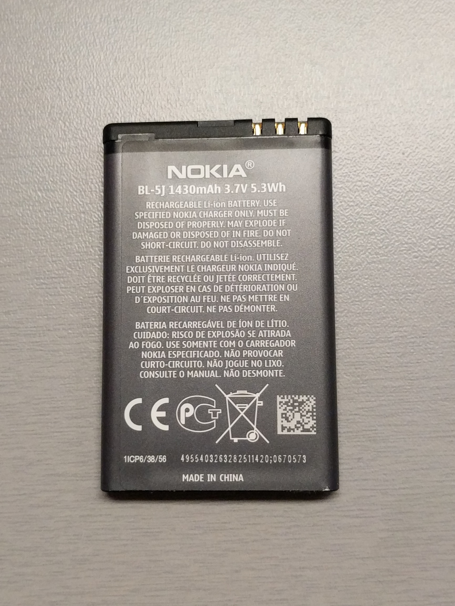

# Electrical power

Main source of power is the BL-5J battery.  

The battery can be recharged through the USB port.

When in power off state, the phone can be started by applying the following current to the USB port:

| Voltage | Duration | Current |
|---------|----------|---------|
| min/max 4.3v / 6.0v | min 250ms | 1.5mA |

In the power off state, the resistance mesured between Vcc and Gnd at the USB port is ~43K&Omega;
