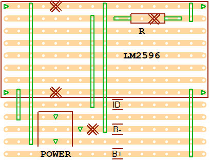
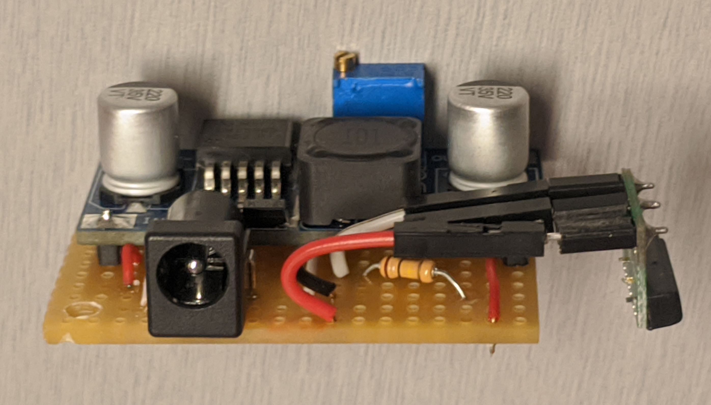
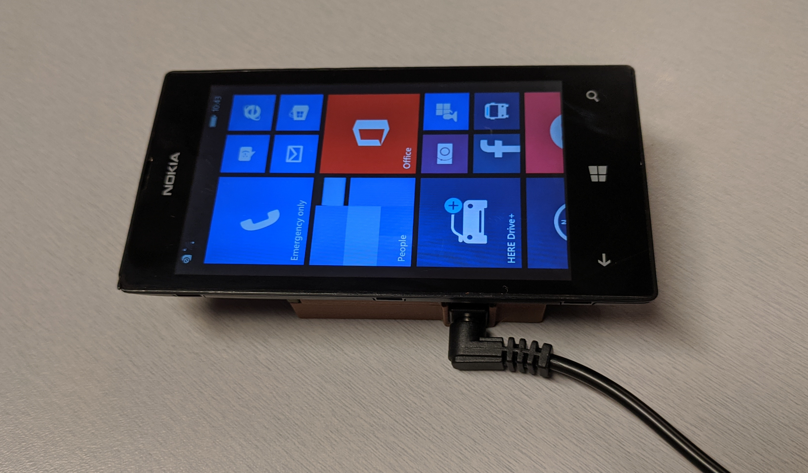
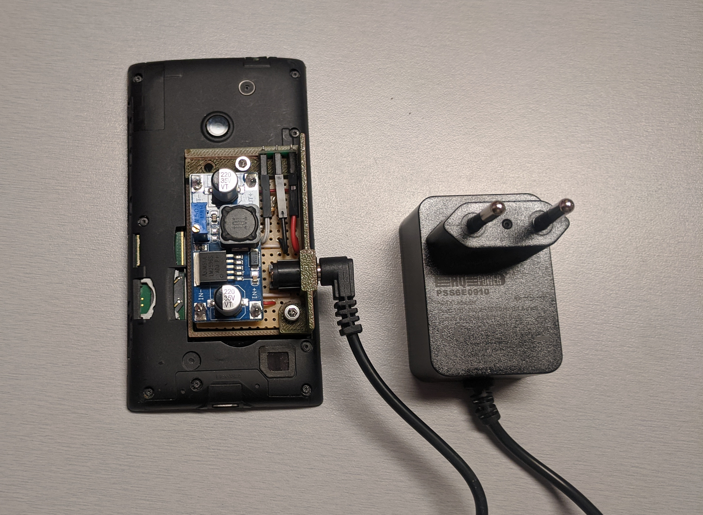
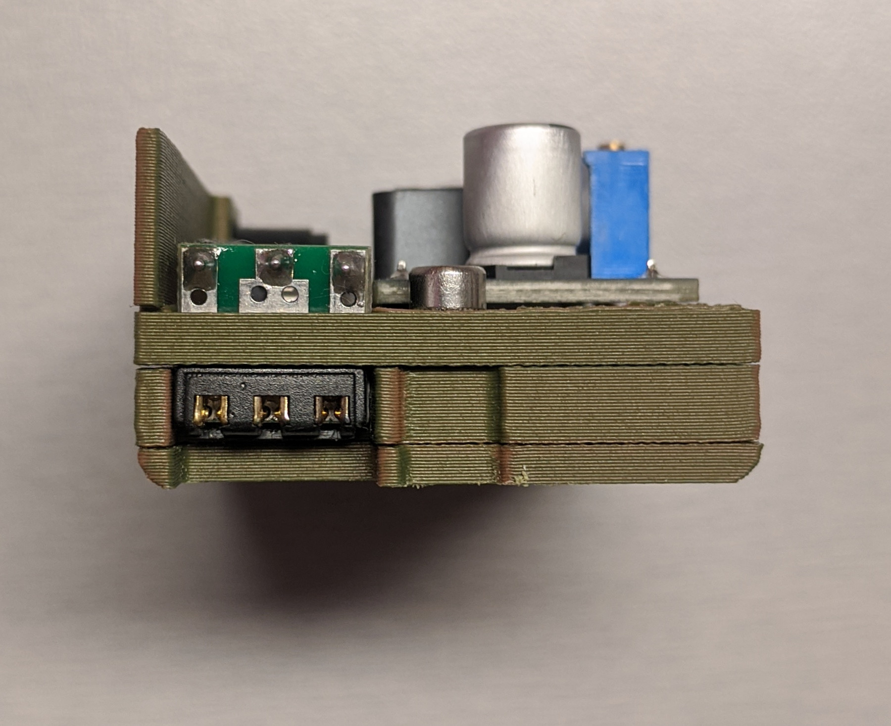
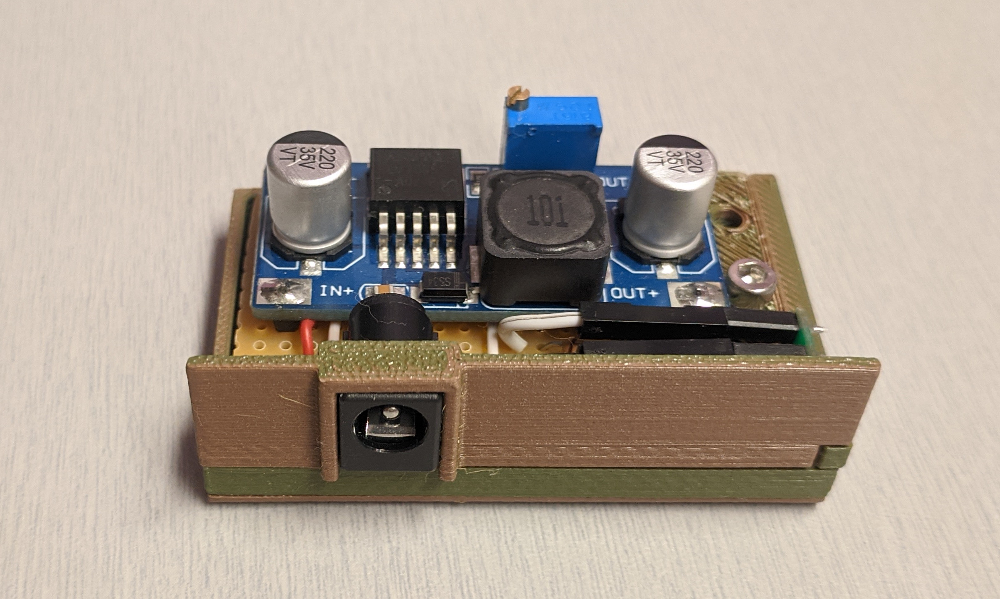
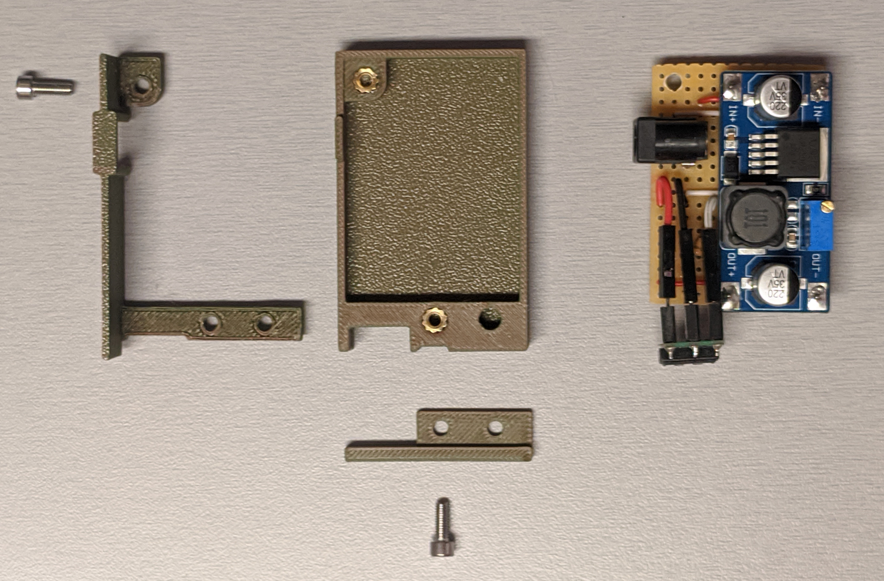

# Fake Battery

## Bill of Materials

- 1x 9V 1A AC-DC Adapter Power Supply 5.5mm x 2.1mm
- 1x DC Power Connector 5.5mm x 2.1mm
- 1x LM2596 2A
- 1x 100k&Omega; resitor
- 1x [Adapter NBA (Nokia Battery Adapter)](adapter-nba-nokia-battery-adapter-p1764.pdf)

## Builds

Circuit made with [VeeCAD 2.46](https://veecad.com/)  

[VeeCAD .per file](fake_battery.per)

Instead of placing the resistor under the LM2596 board, you can connect it directly between `ID` and `B-` as shown in the picture (and you also save two wires):  

3D printed case made with [FreeCAD](https://www.freecad.org/)  
Add 2x M3*8 screws and 2x M3x4x5 inserts for fixation.

[FreeCAD file](fake_battery.FCStd) 
