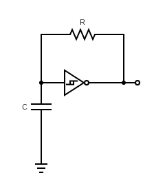
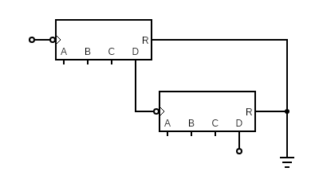
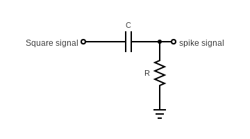
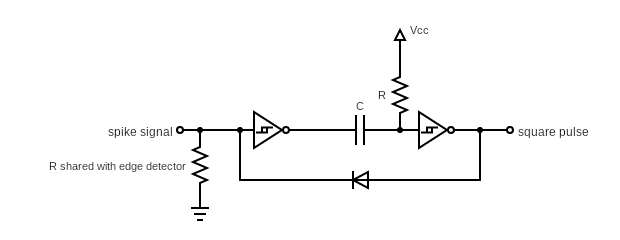
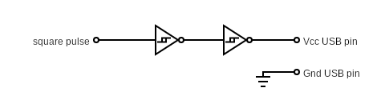

# Pulse Generator

The circuit is composed of 5 stages:

- An oscillator
- A binary counter to decrease the frequency of the oscillator
- An edge detector to detect the rising and falling edges of the oscillations
- A monostable multivibrator to generate the pulse
- An output buffer is used to avoid disturbance to the monostable multivibrator caused by the load (the Lumia 520).

The power source of the circuit can be anything able to generate between 4.5v and 6v and deliver a 1.5mA current.  
For example: two CR2032 coin cells in series.

## The oscillator

To keep the circuit at my low electronic skill, I selected the solution of a _relaxation oscillator_.  
This is not the most efficient solution, because it's not perfectly stable and it consumes _a lot of_ current (around 0.20 mA) but it's very easy to build.  

- One inverted Schmitt trigger
- One resistor
- One capacitor

The capacitor is slowy charged and discharged through the resistor. The charge and the discharge phases are piloted by the inverted Schmitt trigger.  

## The binary counter

The oscillator delivers a periodic signal in the second range; to get a period in the hour range, we use one or two binary counters in series.  
For example, when the oscillator has a frequency of 4Hz (0.25s) then we have to divide it by 16,384 ($2^{14}$) to get a period of 4,096s (~ 1hour and 8 minutes).

## The edge detector

The oscillator gives us a square signal : the duration of the _high_ pulse is equal to the duration of the _low_ pause. As we want a short pulse (~400ms) compared to the long pause (~1 hour) we have to detect the begining of an oscillation and use it as the signal to start our own pulse.  
We can do that with a simple edge detector wich generates a short positive spike (~100µs) on the rising edge of the oscillation and another negative spike on the falling edge.  

## The monostable multivibrator

In my opinion, this is the most difficult part of the circuit to understand.  
The monostable multivibrator is responsible for transforming a previously generated positive spike into a square pulse of several hundred milliseconds.

- Two inverted Schmitt triggers
- One resistor
- One capacitor
- One diod

When idle (between two positive spikes) the components are in this status:
- The input of the first Schmitt trigger is low.
- In consequence, the output of this trigger is high.
- The capacitor is discharged (both ends are high).
- The input of the second Schmitt trigger is high.
- In consequence, the output of this trigger is low. And the output of this stage low also.
- The diod is off as its both ends are low.

When a positive spike arrives:
- The entry of the first Schmitt trigger is high due to the spike.
- In consequence, the output of this first trigger is low and the input of the second Schmitt trigger is low also.
- In consequence, the output of this second trigger is high. And the output of this stage is high also. __This is the begining of the pulse.__
- The current flows through the diod from the high output to the input of the stage, effectively "trapping" the state: Even when the original 100 µs external spike vanishes, the input of the first Schmitt trigger is held high by the output of the second Schmitt trigger.
- The capacitor is charging through the resistor because there is a differential voltage between Vcc (high) and the output of the first Schmitt trigger (low).
- As the capacitor is charging, the voltage at the input of the second Schmitt trigger is slowly rising.
- When this voltage is high enough (typically around $\frac{2}{3}$ of Vcc) the second Schmitt trigger interprets the input as high again.
- In consequence, the output of this second trigger becomes low. And the output of this stage becomes low also. __This is the end of the pulse.__
- The flow of the current through the diod is stopped and the input of the first Schmitt trigger is dragged to low.
- In consequence, the output of this first trigger becomes high and the capacitor is discharged (no difference of voltage between its both ends).
- The stage is idle again and ready for the next spike.

## The output buffer

We cannot directly put an external load a the output of the previous stage, otherwise the diod is unable to maintain the level of the input of the monostable multivibrator.
A Schmitt trigger is used to isolate the monostable multivibrator from the external load. And as this is an inverted Schmitt trigger we have to put both of them in series to ouput the same signal as the input.  
The output of the second Schmitt trigger can directly drive the Vcc pin of the phone's USB port.

