# Do It Yourself phone box

## Original idea

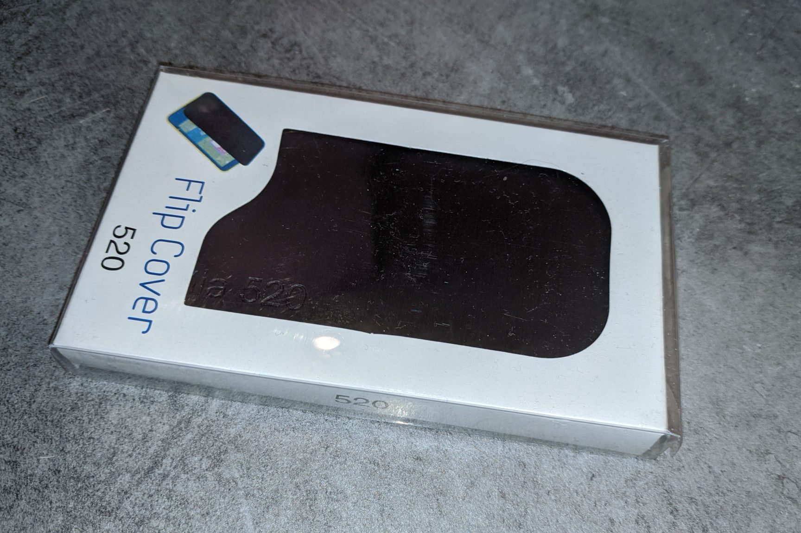

## Final result

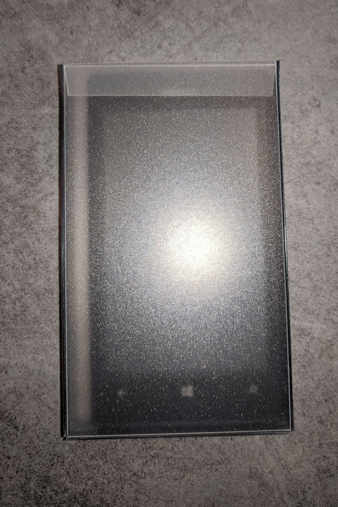

Dimensions (in millimeters):  
122x72x14  
 
## Materials

- A4 paper sheet (for the pattern).
- A4 polypropylene sheet, 600 micrometers.
- Double sided tape 5 millimeters.
- Metal ruler.
- Utility knife.
- Long and thin stick.

## Steps

- Print the [pdf pattern](box.pdf) on a A4 paper sheet.
- Cut the 2 pieces of the pattern. We will use them to create 2 boxes from one sheet of polypropylene.  
- Put the patterns at the 4 corners of the polypropylene cheet and, with the knife, mark their corners and the ends of their fold lines.
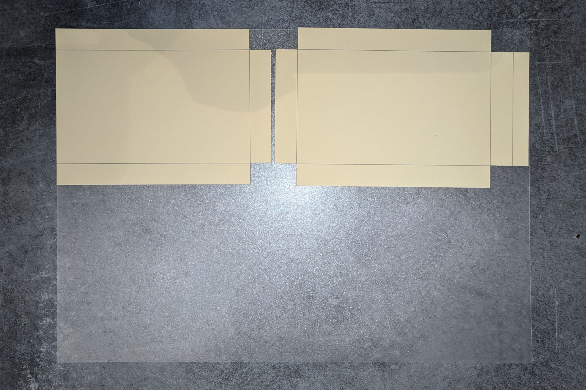
- Using the marks previously made, trace the lines. Apply enough pressure in order be able to easily fold the polypropylene. But don't cut trough it.
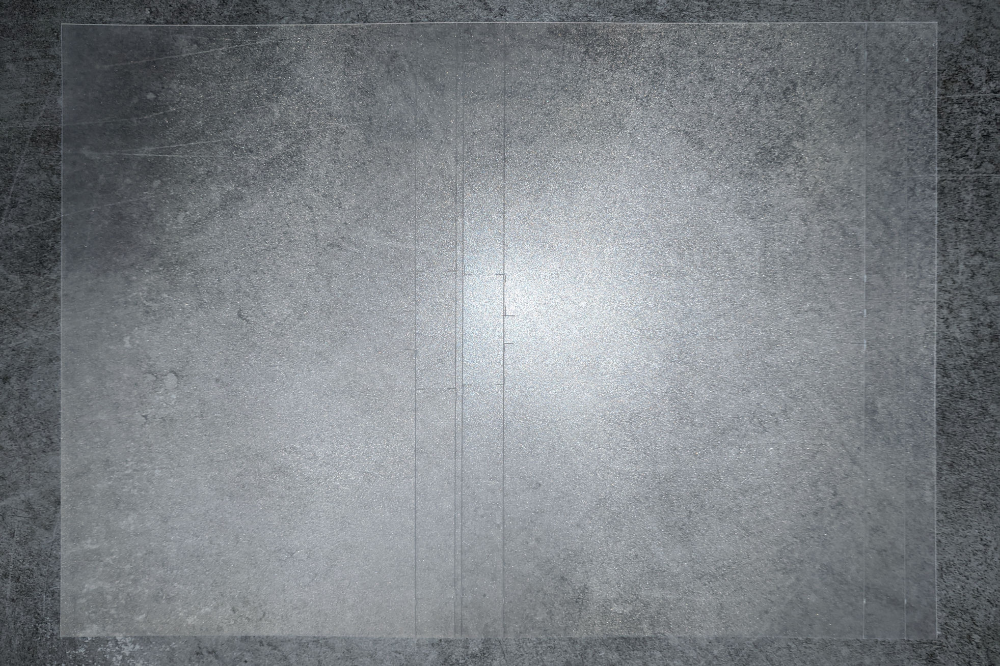
> [!Warning]
> If the cut is too light, the polypropylene brokes when you try to fold it.  
- Tips: Separate the top and the bottom parts to trace more easily the remaing lines.
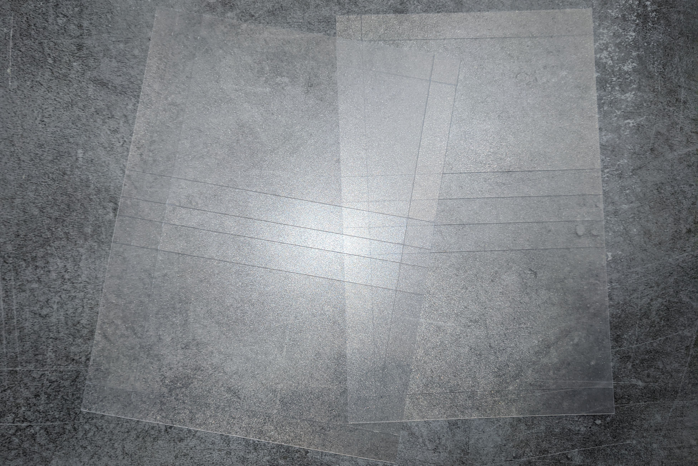  
- When all the lines a traced, cut the final parts.

- Apply the tape on the smallest parts, on the face where the folding lines are visible. Use the knife to cut the overflowing tape.
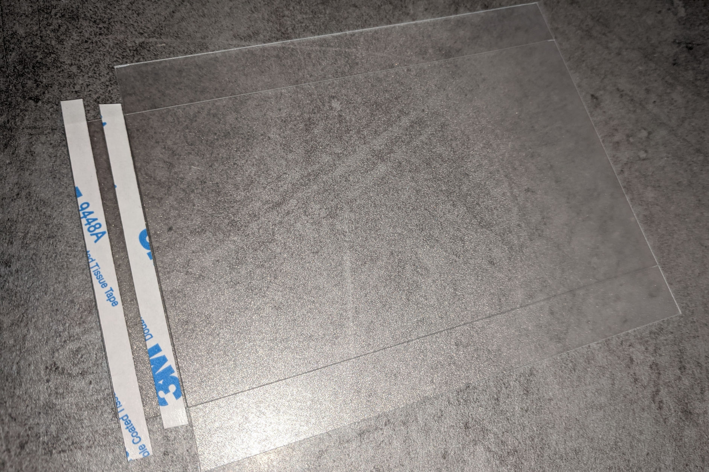
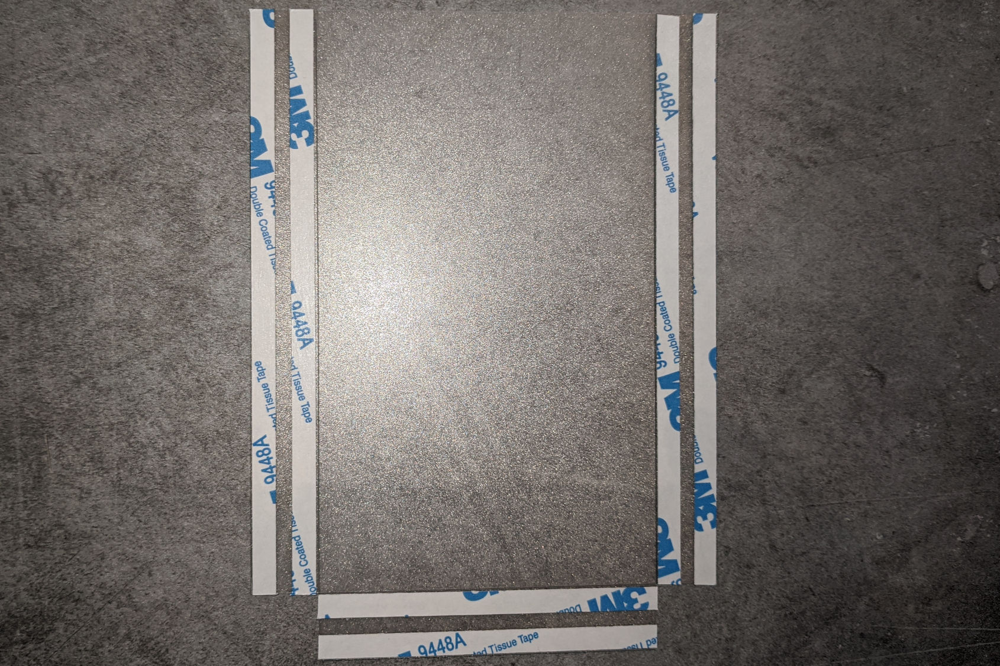
- Fold all the parts. The cutted lines must be on the outside.
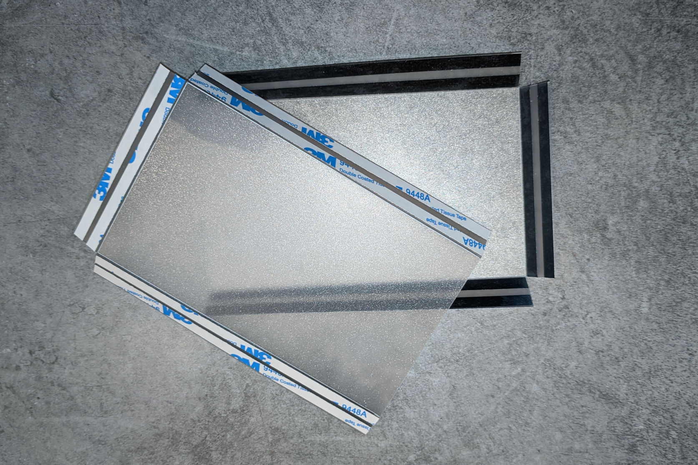
- Join the 2 parts. Align the borders of the opening: the parts with the tape is slighty smaller than the parts without tape.
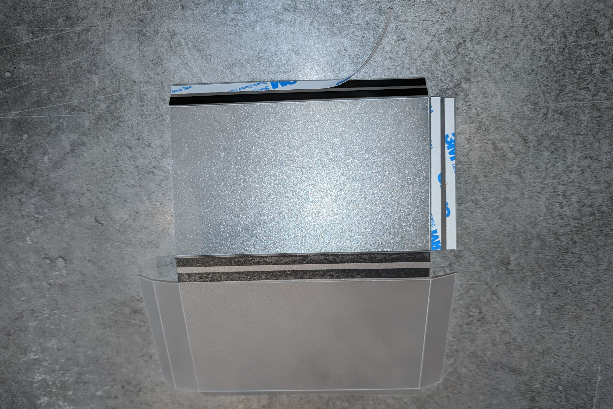
- Join the others faces of the box, finishing by the bottom. Use the long stick to apply pressure on the tape from the inside of the box.
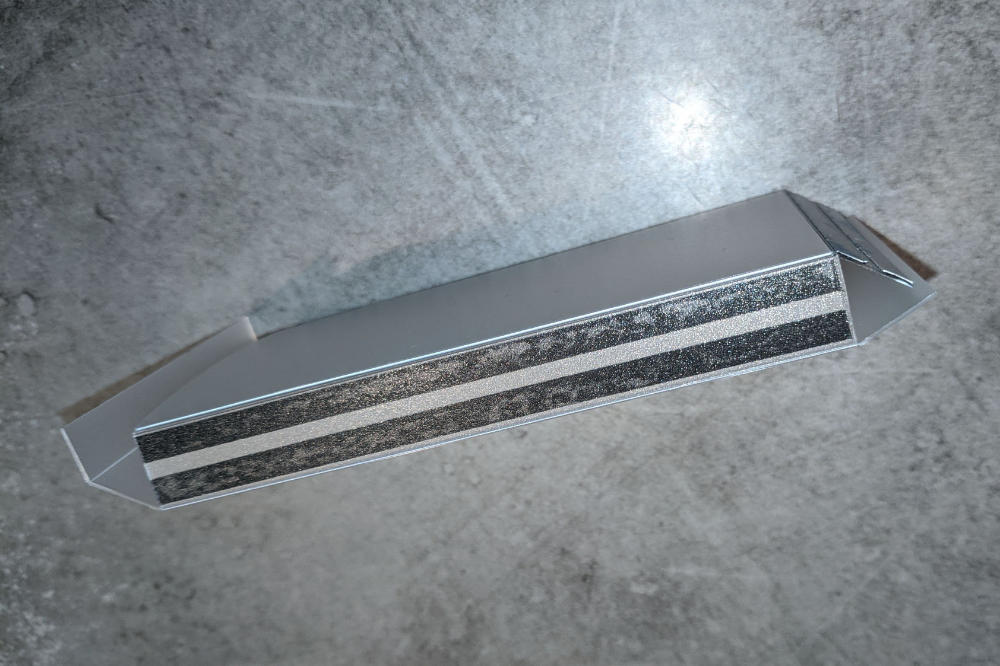  
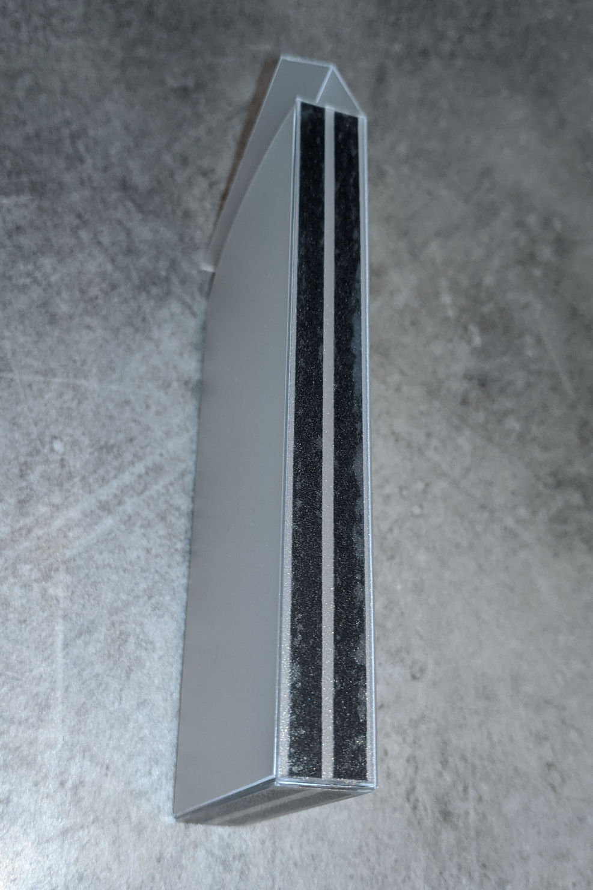
- Finally, slighty cut the corners of the lid in order for it to slide inside the box.
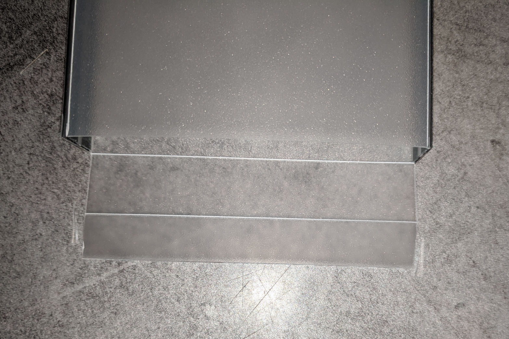
