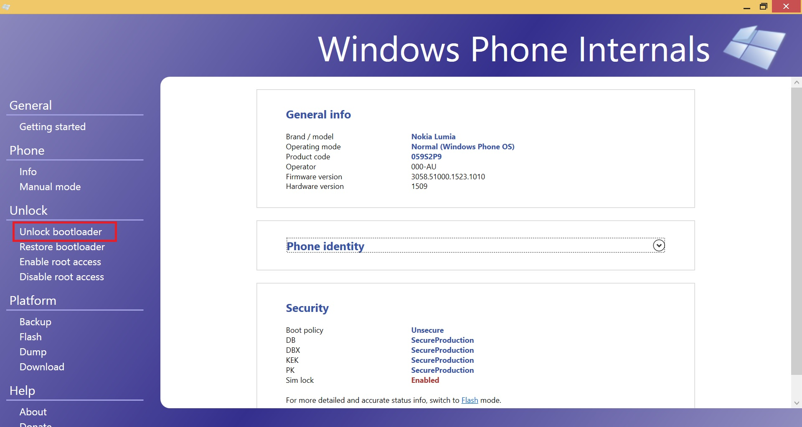
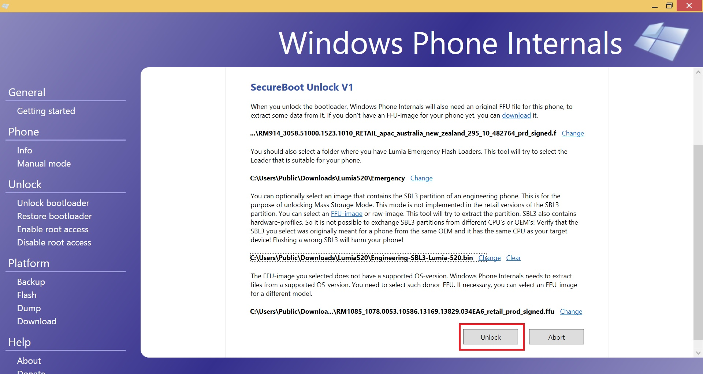
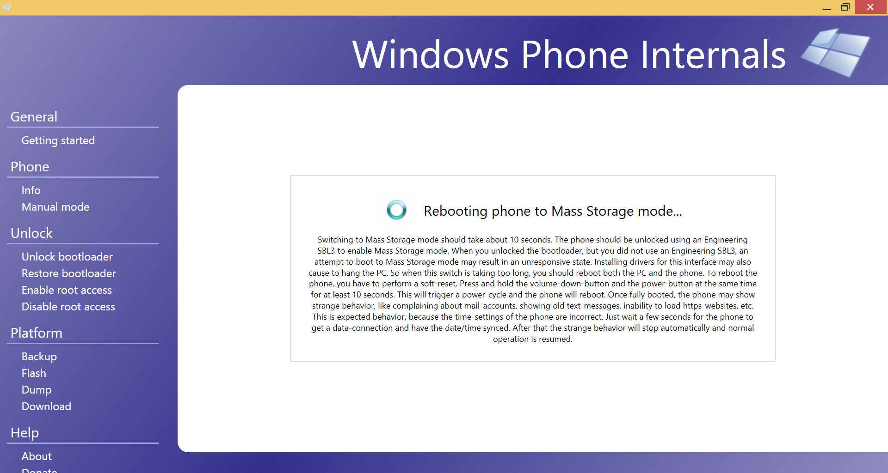
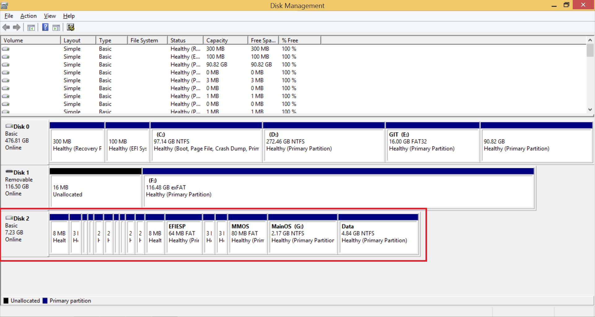
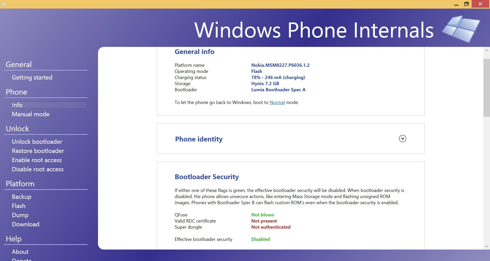

# Unlock the bootloader

Use [WPinternals](https://github.com/ReneLergner/WPinternals)

Reboot the phone as indicated (volume-down + power >10s).  
Then check the bootloader is unlocked.

Basically, WPInternals upates the content of the GUID Partition Table (GPT) to unlock the bootloader:  
It creates a new partition named "HACK".  
This partition has the same "attributes" and the same "type GUID" and "GUID" as the partition SBL2.  
The HACK partition is placed in the last sector of the partition SBL1 with a size of 1 sector (the size of the partition SBL1 is reduced by 1 sector).  
The new "type GUID" and "GUID" of the partition SBL2 are 0x74 16 times.  
The partition table is rewritten with these new information.  

I guess this "HACK" partition - having the same GUID as the SBL2 partition - confuses the secure boot process.  

And optionally, the content of the SBL3 partition is rewritten with an "engineering" version of this partition to activate the "mass storage" mode.  
