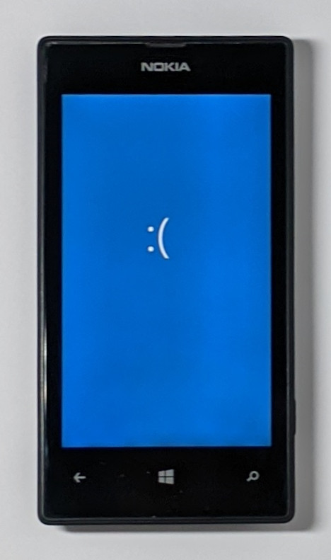

# Revert to Windows Phone 8.1

from [Linux](/content/linux/README.md) or [Android](/content/android/README.md)

Use the .img file (full backup) you created at the beginning of the installation of [Android](/content/android/README.md).

Create a folder "parts" and extract the partitions of the .img files using imgman64.exe or 7zip (faster than imgman64).

Example with imgman64.exe:  
```
imgman64.exe <your backup>.img parts
```

Reboot the phone in fastboot mode (keep volume-down pressed during reboot).  

Boot a special version of TWRP with "root adb" activated (not touch screen action required !):
```
fastboot boot recovery_unsecure.img
```

Send a file containing the Windows Phone partition table to the phone:
```
adb push fame_wp_unlocked.gpt /cache/
```

Open a root shell on the phone:
```
adb shell
```

Modify the partition table of the phone:
```
# sgdisk --load-backup /cache/fame_wp_unlocked.gpt /dev/block/mmcblk0
```

Force the update of the physical storage, then reboot the phone:
```
# sync
# sync
# reboot
```

Do also a cold reboot (press volume-down + power more than 10 secondes) in order to be sure to use the new partition table.  
Reboot the phone in fastboot mode (keep volume-down pressed during reboot).   

Flash the partitions (extracted at the beginning of this document) in the order given by the following list of partition names:

1. TZ
2. SSD
3. RPM
4. WINSECAPP
5. MODEM_FSG
6. MODEM_FS1
7. MODEM_FS2
8. UEFI_BS_NV
9. UEFI_NV
10. UEFI_RT_NV
11. UEFI_RT_NV_RPMB
12. PLAT
13. MMOS
14. EFIESP
15. UEFI

```
fastboot flash <partition name> parts\<partition file>.img
```

Then reboot the phone:
```
fastboot reboot
```

It's expected to see a "smiley of death" :( after this reboot.  


Now, you must flash the .ffu file of your phone:
```
thor2 -mode rnd -bootflashapp
thor2 -mode uefiflash -ffufile "D:\Users\Public\Downloads\Lumia520\Denim_RM914_059S341_3058.51000.1523.1010\RM914_3058.51000.1523.1010_RETAIL_apac_australia_new_zealand_295_10_482764_prd_signed.ffu" -do_full_nvi_update -do_factory_reset
```

Finally, reboot your phone:
```
thor2 -mode rnd -bootnormalmode
```
