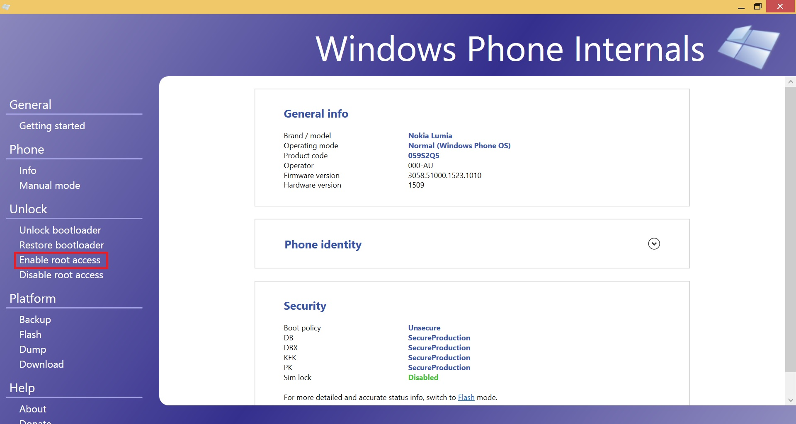
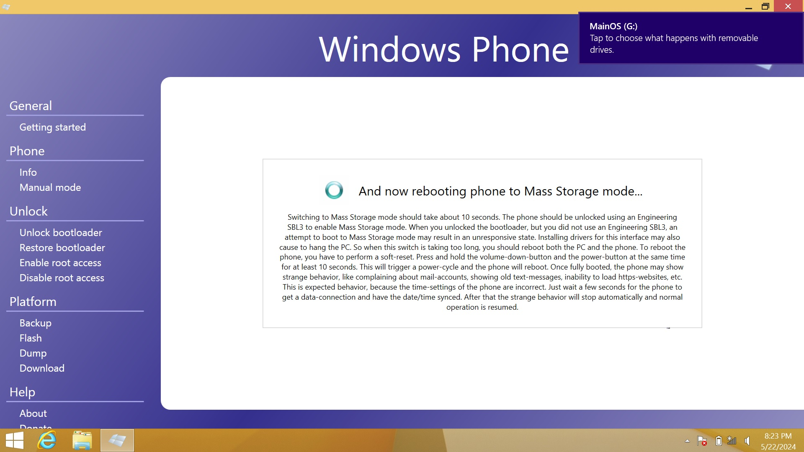

# Enable root (Windows Phone 8.1)

Use [WPinternals](https://github.com/ReneLergner/WPinternals)

> [!NOTE]
> In fact you won't really become the "root" user like in a Linux system.  
> But you will have the possibility to acquire access to almost all resources of the Windows Phone. See for example [wp81Elevation](https://github.com/fredericGette/wp81Elevation).  
> And you will also be able to sideload applications.

First [unlock the bootloader](/content/unlock_bootloader/Readme.md)

In my case the "enable root access" of WPinternals 2.9 is unable to detect the phone is in mass storage mode:

As a workaround, you can test older version of WPinternals (even version 1.x should be able to deal with the Lumia 520).
In my case version 2.8 works better than version 2.9
